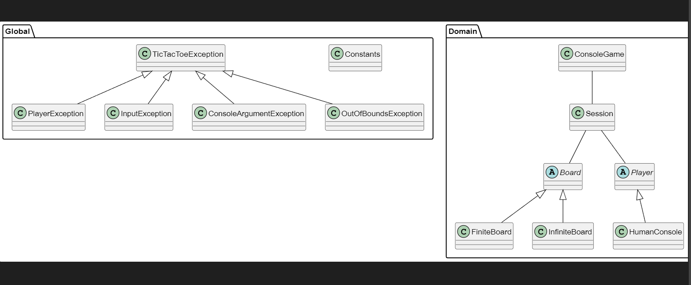

# Tic-Tac-Toe
This is an OOP implementation of classic Tic-Tac-Toe board game. Currently, it supports only displaying the board in the standard output (usually terminal). Finally, it uses only built-in C# features.

## OOP Structure
The hierarchical struture of used classes is shown in the following class diagram:

